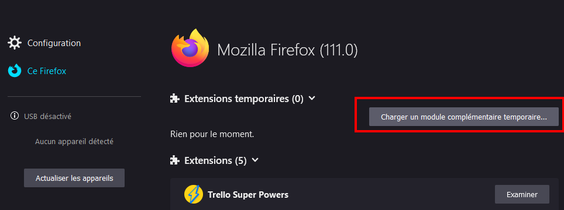
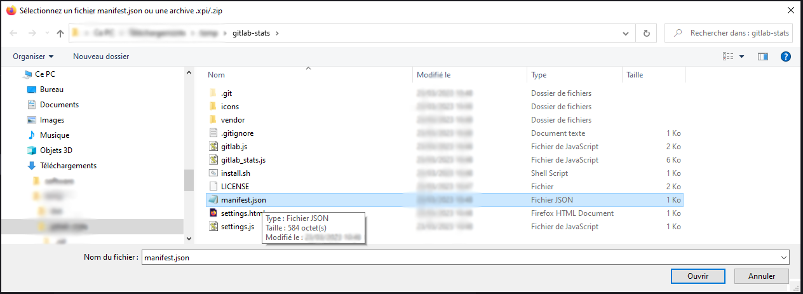
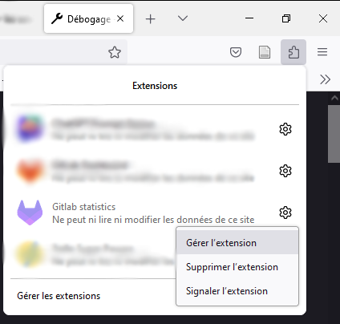
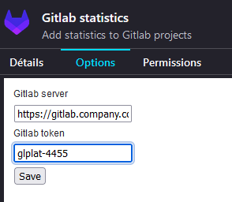

<div align="center">
  
  <h1>Gitlab-stats</h1>
</div>

Firefox add on displaying statistics about Gitlab projects.

## How to install

_This guide is a temporary installation guide, meant for developers and beta testers_.

1. Clone this repository

```bash
git clone https://github.com/Doreapp/gitlab-stats.git
cd gitlab-stats
```

2. Install the libraries

```bash
./install.sh
```

3. In Firefox, open a tab with url `about:debbuging`. Then click on `Load Temporary Add-on` button.



3. Select a file in (prevously-cloned) `gitlab-stats` directory



4. Go to the extension settings



4. Define GitLab server and add your access token (one API scope is required)



## 💡 Development hints

- [Guide - Your first extension](https://developer.mozilla.org/en-US/docs/Mozilla/Add-ons/WebExtensions/Your_first_WebExtension)
- [Extensions examples](https://github.com/mdn/webextensions-examples)
- [Magical `about:debugging` webpage](about:debugging)
